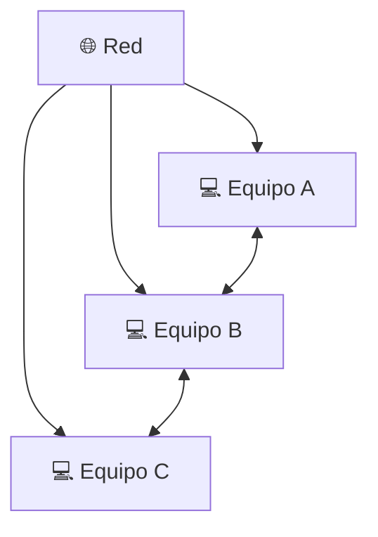

# 🕰️ Evolución Histórica de los Sistemas Operativos

Los sistemas operativos que utilizamos actualmente son el resultado de muchos años de evolución.

Las primeras computadoras no tenían sistemas operativos como los conocemos hoy. Con el paso del tiempo surgieron nuevas formas de organizar la ejecución de programas, aprovechar mejor los recursos y permitir que varias tareas o usuarios pudieran utilizar un sistema.

Podemos observar esta evolución como una serie de etapas.

---

##  1. Primeros sistemas

En las primeras computadoras, la interacción con la máquina era mucho más directa.

No existía un sistema operativo encargado de administrar automáticamente las tareas. Los usuarios debían preparar y ejecutar los programas de una forma mucho más manual.

Esto hacía que utilizar una computadora fuera un proceso complicado y que una gran parte del tiempo del equipo pudiera quedar desaprovechada.

!!! note "Una gran diferencia"
    Actualmente encendemos una computadora y encontramos inmediatamente un entorno preparado para ejecutar programas. En los primeros sistemas, muchas de esas tareas de organización debían realizarse manualmente.

---

##  2. Monitores residentes y sistemas por lotes

Para reducir la intervención manual comenzaron a utilizarse programas conocidos como **monitores residentes**.

Su función era mantener un pequeño programa en memoria que ayudara a controlar la ejecución de los trabajos.

Posteriormente aparecieron los sistemas de procesamiento por lotes o **Batch Systems**.

En ellos, varios trabajos se agrupaban para ser ejecutados uno después de otro.

##  3. Multiprogramación

Con el tiempo surgió la **multiprogramación**, una técnica que permitió mantener varios programas en memoria al mismo tiempo.

La idea principal era aprovechar mejor el procesador. Si un programa tenía que esperar por alguna operación, el sistema podía permitir que otro utilizara la CPU en lugar de dejarla sin trabajar.

!!! tip "La idea importante"
    La multiprogramación permitió aprovechar mejor los recursos de la computadora, ya que mientras un programa esperaba, otro podía continuar trabajando.

Este concepto fue muy importante para el desarrollo de la administración de procesos que utilizan los sistemas operativos actuales.

---

##  4. Sistemas de tiempo compartido

Después apareció el concepto de **tiempo compartido**, que buscaba permitir una mayor interacción entre los usuarios y la computadora.

En estos sistemas, el procesador distribuye pequeños periodos de tiempo entre diferentes tareas o usuarios.

El cambio ocurre rápidamente, dando la sensación de que varias tareas están siendo atendidas al mismo tiempo.

Por ejemplo:

**Usuario A → CPU → Usuario B → CPU → Usuario C → CPU → Usuario A...**

!!! example "Un ejemplo sencillo"
    Podemos imaginar una computadora utilizada por varios usuarios. En lugar de permitir que uno utilice todos los recursos durante mucho tiempo, el sistema reparte pequeños turnos de procesamiento entre ellos.

Esta idea está relacionada con conceptos que veremos más adelante, como la **planificación de CPU** y el reparto del tiempo de procesamiento.

---

##  5. Sistemas distribuidos

Con el crecimiento de las redes surgieron sistemas capaces de conectar varias computadoras para compartir información, recursos o trabajo.

En un **sistema distribuido**, diferentes equipos pueden colaborar mediante una red para realizar determinadas tareas.

Esto permite que los recursos utilizados por un sistema no necesariamente se encuentren en una sola computadora.

!!! note "¿Qué cambia aquí?"
    En lugar de pensar únicamente en los recursos de una computadora, comenzamos a trabajar con varios equipos que pueden comunicarse y colaborar entre sí.

---

##  6. Sistemas de tiempo real

En algunos sistemas no solamente importa obtener un resultado correcto, sino también **obtenerlo dentro de un tiempo determinado**.

Los **sistemas de tiempo real** están diseñados para responder a ciertos eventos dentro de límites de tiempo establecidos.

Este tipo de sistemas puede encontrarse en áreas como:

- Sistemas industriales.
- Control de maquinaria.
- Sistemas automotrices.
- Equipos especializados.
- Sistemas de monitoreo y control.

!!! warning "Tiempo real no significa simplemente rápido"
    Lo importante es que una tarea responda dentro del tiempo requerido. En algunos sistemas, una respuesta correcta que llegue demasiado tarde puede dejar de ser útil.

---

##  7. Virtualización y contenedores

Los sistemas modernos también han incorporado tecnologías que permiten aprovechar los recursos de una computadora de nuevas maneras.

Una de ellas es la **virtualización**, que permite crear varias máquinas virtuales dentro de una misma computadora física.

Cada máquina virtual puede funcionar como un entorno independiente y puede tener su propio sistema operativo y sus propias aplicaciones.

###  ¿Y los contenedores?

Los **contenedores** también permiten crear entornos separados para ejecutar aplicaciones, pero funcionan de una manera más ligera que una máquina virtual completa.

En lugar de necesitar un sistema operativo completo para cada entorno, los contenedores pueden compartir componentes del sistema operativo anfitrión mientras mantienen las aplicaciones aisladas.

!!! example "Un ejemplo actual"
    Tecnologías como Docker utilizan contenedores para empaquetar una aplicación junto con los elementos que necesita para funcionar. Esto facilita que pueda ejecutarse de una forma similar en diferentes equipos.

---

##  Resumen de la evolución

Podemos visualizar el cambio de los sistemas operativos de una manera sencilla:

| Etapa | Cambio principal |
|---|---|
| **Primeros sistemas** | Gran parte del trabajo se realizaba manualmente. |
| **Monitores residentes** | Se comenzaron a automatizar algunas tareas de control. |
| **Sistemas por lotes** | Los trabajos se agrupaban y ejecutaban uno después de otro. |
| **Multiprogramación** | Varios programas podían permanecer en memoria para aprovechar mejor la CPU. |
| **Tiempo compartido** | El tiempo del procesador se repartía entre diferentes tareas o usuarios. |
| **Sistemas distribuidos** | Varias computadoras podían colaborar mediante una red. |
| **Tiempo real** | Se volvió fundamental responder dentro de límites de tiempo determinados. |
| **Virtualización y contenedores** | Se pueden crear diferentes entornos utilizando los recursos de una misma infraestructura. |

---

##  ¿Qué cambió con el tiempo?

Aunque cada etapa introdujo nuevas características, podemos observar una idea que se mantiene durante toda esta evolución:

**Los sistemas operativos fueron cambiando para aprovechar mejor el hardware, facilitar el uso de las computadoras y administrar una cantidad cada vez mayor de tareas y recursos.**

Pasamos de sistemas que requerían una gran cantidad de intervención manual a sistemas capaces de administrar programas, usuarios, dispositivos y diferentes entornos de ejecución.

!!! note "Idea principal"
    La evolución de los sistemas operativos ha estado relacionada con las necesidades que fueron apareciendo junto con el avance de las computadoras: primero automatizar tareas, después aprovechar mejor los recursos y finalmente permitir sistemas cada vez más complejos, conectados y flexibles.