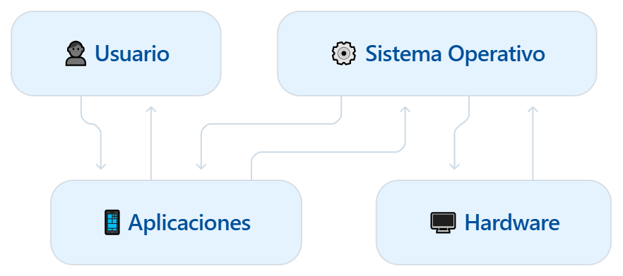

# 💻 Unidad 1 — Introducción a los Sistemas Operativos

Los sistemas operativos forman una parte fundamental de cualquier dispositivo que utilizamos todos los días. Aunque muchas veces no pensemos en todo lo que ocurre detrás de una computadora o un teléfono, el sistema operativo está constantemente trabajando para que podamos abrir programas, guardar archivos, conectarnos a internet o utilizar diferentes dispositivos.

Podemos pensar en el sistema operativo como el encargado de mantener organizado todo lo que ocurre dentro del equipo. Es el intermediario entre nosotros, las aplicaciones que utilizamos y el hardware de la computadora.

!!! info  "En pocas palabras"
     El **Sistema Operativo** hace posible que el usuario pueda utilizar el hardware sin tener que preocuparse por todos los detalles internos de cómo funciona.

---

## ¿Qué veremos en esta unidad?

En esta unidad conoceremos los conceptos básicos necesarios para comprender cómo funciona un sistema operativo y por qué es tan importante dentro de un sistema informático.

A lo largo de los temas aprenderemos:

- Qué es un **sistema operativo** y cuál es su función.
- Cómo administra recursos como la **CPU, memoria, almacenamiento y dispositivos**.
- Cómo han evolucionado los sistemas operativos con el paso del tiempo.
- Qué son las **llamadas al sistema o System Calls**.
- La diferencia entre **modo usuario y modo kernel**.
- Las distintas formas en las que podemos **clasificar los sistemas operativos**.

---

## ¿Por qué necesitamos un sistema operativo?

Imaginemos que cada programa tuviera que controlar directamente la memoria, el procesador, el disco duro y todos los dispositivos conectados a la computadora.

Además de ser muy complicado, varios programas podrían intentar utilizar el mismo recurso al mismo tiempo y provocar problemas.

El sistema operativo evita esto al encargarse de administrar los recursos y controlar la manera en que los programas pueden utilizarlos.

!!! tip "Un ejemplo sencillo"
    Cuando tenemos abiertas varias aplicaciones al mismo tiempo, no somos nosotros quienes decidimos exactamente cuánto tiempo de CPU utiliza cada una o qué parte de la memoria le corresponde. El sistema operativo realiza gran parte de esa administración.

---

## El sistema operativo como intermediario

Una forma sencilla de visualizar su funcionamiento es pensar en la relación que existe entre el usuario, las aplicaciones, el sistema operativo y el hardware.

<figure markdown="span">
  
  <figcaption>
    Relación entre el usuario, las aplicaciones, el sistema operativo y el hardware.
  </figcaption>
</figure>

El usuario interactúa con las aplicaciones y estas, a su vez, dependen del sistema operativo para acceder de forma controlada a los recursos del hardware.

Por ejemplo, cuando una aplicación necesita guardar un archivo, utilizar memoria o comunicarse con algún dispositivo, normalmente realiza la solicitud a través del sistema operativo.