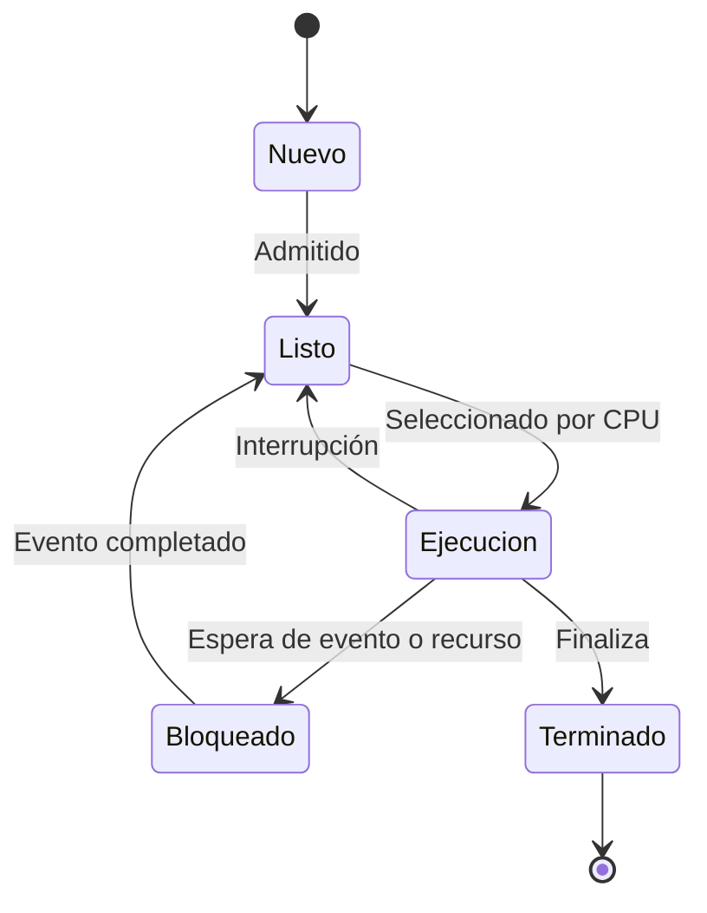

# 🔄 Estados de un Proceso

Cuando ejecutamos un programa, el proceso que se crea **no utiliza la CPU todo el tiempo**. Durante su funcionamiento puede estar esperando su turno, ejecutándose, esperando algún recurso o incluso haber terminado.

Para que el sistema operativo pueda saber qué está ocurriendo con cada proceso, utiliza diferentes **estados**.

> 💡 Podemos pensar en los estados como las diferentes etapas por las que pasa un proceso desde que nace hasta que termina.

---

## 🆕 Estado Nuevo

Un proceso se encuentra en estado **Nuevo** cuando acaba de ser creado y el sistema operativo está preparando la información y los recursos necesarios para administrarlo.

En esta etapa, el proceso todavía no está utilizando la CPU.

!!! tip "Ejemplo"
    Cuando abrimos una aplicación, el sistema operativo comienza a crear el proceso correspondiente. Durante esos primeros momentos podemos considerar que se encuentra en estado **Nuevo**.

---

## ⏳ Estado Listo

Un proceso pasa al estado **Listo** cuando ya está preparado para ejecutarse, pero todavía está esperando que la CPU esté disponible.

Esto no significa que exista algún problema con el proceso. Simplemente hay otros procesos que también necesitan utilizar el procesador y el sistema operativo debe decidir cuál tendrá el siguiente turno.

!!! info "Una forma sencilla de verlo"
    Imaginemos una fila para utilizar la CPU. Los procesos que están en estado **Listo** ya tienen todo preparado, pero deben esperar su turno.

---

## ⚙️ Estado de Ejecución

Cuando el sistema operativo selecciona uno de los procesos que estaban listos y le asigna la CPU, este pasa al estado **Ejecución**.

Aquí es donde realmente se están procesando sus instrucciones.

Por ejemplo, mientras utilizamos una aplicación, algunos de sus procesos pueden recibir tiempo de CPU para realizar cálculos, responder a nuestras acciones o procesar información.

> **Listo → Ejecución:** ocurre cuando el proceso recibe tiempo de CPU.

---

## ⏸️ Estado Bloqueado o en Espera

Un proceso entra en estado **Bloqueado/Espera** cuando no puede continuar hasta que ocurra algún evento o se encuentre disponible algún recurso que necesita.

Por ejemplo, podría estar esperando:

- Que termine una operación de entrada o salida.
- Información proveniente de un dispositivo.
- La disponibilidad de algún recurso.
- Que ocurra un evento necesario para continuar.

Mientras está bloqueado, no tendría sentido darle tiempo de CPU porque todavía no puede continuar con su trabajo.

!!! tip "Ejemplo"
    Imaginemos un proceso que necesita leer información de un archivo. Mientras espera que la operación termine, puede permanecer **Bloqueado**. Cuando la información está disponible, puede regresar al estado **Listo**.

---

## 🏁 Estado Terminado

Finalmente tenemos el estado **Terminado**.

Un proceso llega a este estado cuando termina de ejecutar sus instrucciones o cuando su ejecución es finalizada.

El sistema operativo puede entonces comenzar a liberar los recursos que estaban asociados con ese proceso.

Esto es parecido a lo que ocurre en nuestro simulador: cuando el contador de un proceso llega al final, el proceso deja de ejecutarse y la memoria RAM que estaba utilizando vuelve a quedar disponible.

---

## 🗺️ Diagrama de transición de estados

Los estados no funcionan de manera aislada. Durante su ciclo de vida, un proceso puede pasar de un estado a otro dependiendo de lo que esté ocurriendo dentro del sistema.

!!! note "Fíjate en algo importante"
    Un proceso no necesariamente pasa una sola vez por **Listo** y **Ejecución**. Puede regresar varias veces a estos estados antes de terminar.

---

## 🔁 ¿Por qué ocurren estas transiciones?

Podemos entender las principales transiciones de esta manera:

| Transición | ¿Qué está pasando? |
|---|---|
| **Nuevo → Listo** | El proceso ya fue creado y puede comenzar a competir por la CPU. |
| **Listo → Ejecución** | El sistema operativo selecciona el proceso para utilizar la CPU. |
| **Ejecución → Listo** | El proceso deja temporalmente la CPU y vuelve a esperar su turno. |
| **Ejecución → Bloqueado** | Necesita esperar un evento o recurso antes de continuar. |
| **Bloqueado → Listo** | Lo que estaba esperando ya ocurrió y puede volver a competir por la CPU. |
| **Ejecución → Terminado** | El proceso terminó su trabajo. |

---

## 💡 Un ejemplo completo

Imaginemos que abrimos un editor de texto:

**1. 🆕 Nuevo**  
El sistema operativo comienza a crear el proceso.

**2. ⏳ Listo**  
El proceso está preparado, pero espera que la CPU pueda atenderlo.

**3. ⚙️ Ejecución**  
La CPU comienza a ejecutar sus instrucciones.

**4. ⏸️ Bloqueado**  
El proceso necesita esperar, por ejemplo, que termine una operación relacionada con un archivo.

**5. ⏳ Listo nuevamente**  
La operación termina y el proceso vuelve a estar preparado para utilizar la CPU.

**6. ⚙️ Ejecución nuevamente**  
El sistema operativo vuelve a darle tiempo de CPU.

**7. 🏁 Terminado**  
Cerramos la aplicación o el proceso termina su trabajo.

---

## 🧪 Relación con SO Explorer

Nuestro simulador también permite observar algunos de estos conceptos.

Cuando creamos un proceso y existe memoria suficiente, este aparece como:

> 🟢 **Ejecutando**

Si no existe suficiente memoria, nuestro simulador lo coloca en:

> 🟡 **Cola de espera**

Cuando un proceso termina, libera la memoria que estaba utilizando y el simulador revisa si alguno de los procesos que se encuentran esperando puede comenzar su ejecución.

!!! warning "Importante sobre el simulador"
    Nuestro simulador utiliza una versión simplificada de estos conceptos. La **cola de espera por falta de memoria** que mostramos no representa exactamente todos los motivos por los que un proceso real entra al estado Bloqueado. Su objetivo es ayudarnos a visualizar la administración de procesos y recursos de una manera sencilla.

[⚙️ Probar el simulador →](../simulador/index.md)

---

## 🧠 En resumen

Durante su existencia, un proceso puede pasar por cinco estados principales:

**🆕 Nuevo → ⏳ Listo → ⚙️ Ejecución → ⏸️ Bloqueado/Espera → 🏁 Terminado**

El sistema operativo controla las transiciones entre estos estados dependiendo de la disponibilidad de CPU, los eventos que ocurren y los recursos que necesita cada proceso.